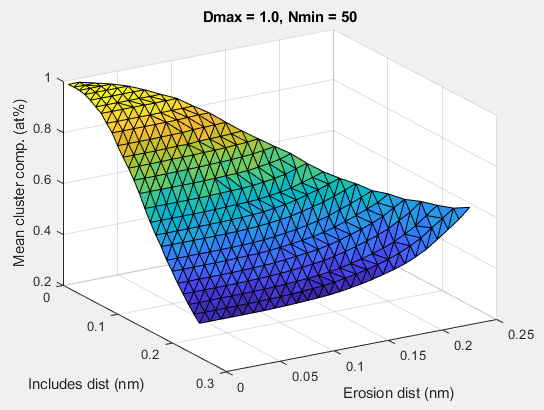

# posgenpy
Python-based driver for cluster analysis using [posgen](http://apttools.sourceforge.net). These tools are to help make analysis by [posgen](http://apttools.sourceforge.net) easier.
## Installation 
Installation
1.	Install Anaconda (https://www.anaconda.com/products/individual). This will give you access to Python, Jupyter notebooks and other useful packages.
2.	Install posgen (https://sourceforge.net/projects/apttools/files/posgen/0.0.3/) 
3.	Install GitHub Desktop (https://desktop.github.com/)
4.	Clone the posgenpy repo from GitHub to your local computer so that it can be used in GitHub Desktop
5.	Run the support/compile.sh script to download and compile libatomprobe
6.	Open Anaconda Navigator and then launch jupyter notebook
7.	Within jupyter notebook, navigate to your GitHub folder and open ‘Posgen test.ipynb’

## Installation of libatomprobe for Windows Subsystem for Linux (WSL)

WSL is a light-weight virtuaisation system for running linux applications
under Windows, in a "native" way. libatomprobe can be used in this way,
including with python support

To install WSL, follow these instructions, entering commands in WSL
* Install  WSL and Ubuntu App 
    Go to this URL : https://docs.microsoft.com/en-us/windows/wsl/install-win10
* (optional) Update Python (run command from inside WSL)
    > ```$ sudo apt-get update && sudo apt-get upgrade && sudo apt-get install python3```
* Install dependencies (run command from inside WSL)
    > ```sudo apt-get update && sudo apt-get upgrade && sudo apt-get install libgsl-dev libqhull-dev libxml2-dev g++ cmake swig```
* (optional) Enable python support in libatomprobe
    - In CMakeLists.txt, change "set(ENABLE_SWIG no)" to "set(ENABLE_SWIG yes)"
* From libatomprobe/ directory, run: 
   > ```$ cmake .```
   > ```$ make```
   > ```$ sudo make install```
    
Useful hints for using WSL: 
* paste text into the terminal using right-click (ctrl+v does not work)
* to access files from Windows drives change ```C:\...``` into ```/mnt/c/```. Remember to change all backslashes to 
    forward slashes ("\\" => "/")
* to access data from an external drive, e.g. D:
    * create a directory if needed 
        > ``` $ sudo mkdir /mnt/d ``` 
    * mount the drive
        > ```$ sudo mount -t drvfs D: /mnt/d```
    * now the data is accessable from ```/mnt/d```
    * safely unmount the drive at the end of the session 
        > ```$ sudo umount /mnt/d```

## To do
### 07/05/20
1. Peter to write up instructions for WSL install. Include copy/paste instructions for Linux WSL, and instructions for mounting external drive.
2. Jupyter notebook examples for libatomprobe.
3. Example files for python for libatomprobe example folder.
4. James (and Andy) to write up Word doc for XML file generator as functions, and upload to github.
5. Peter to push his posfile relabelling jupyter notebook to github.
6. Andy to provide XML file which generates a "test" pos file using posgen which everyone can use.

### 01/05/20
1. Peter: <br>
1.1 Investigate WSL further <br>
1.2 Parameter selection function: build on random relabelling work, with focus on data visualisation, to recreate graphs from Williams2013 paper (dx.doi.org/10.1016/j.ultramic.2012.12.011). Include 95% confidence intervals on plots.
2. James and Andy: multiple cluster options per XML file, so that .pos file only has to be loaded once
3. Hazel: investigate subprocess module (Popen) to get live terminal output using python (completed by Andy, Andy to push to github)

#### Other thoughts
1. Pole removal feature
2. Initial coarse parameter sweep to be followed by fine parameter sweep for cluster searching
3. Options other than grid-based parameter searching do exist, and may be faster


### 27/04/20
1. Investigate using Windows Subsytem for Linux (WSL) to simplify install and facilitate compatibility with libatomprobe (Peter to look into this)
2.	Posgen output file reader, cluster-stats and size distribution (?who)
3.	Range file reader (will specify all core and bulk ions for now and come back to this, may not need if we go with libatomprobe)
4.	XML generator (Andy and James F working on this, **prototype working 29/4/20**)
5.	Sweep Nmin, Dmax, Order, L, E (James F working on this, already has ideas outline, will be mainly XML)
5.1.	Output graph (Dmax vs Nmin vs cluster count etc.) 
5.2.	Output cluster composition, sizes, number
6.	Random mass re-labeller (that is actually random!) (Peter is working on this)
6.1.	Compare results to this randomised set 
6.2.	Perform statistical tests
7.	Analyse multiple .pos files at once to generate matrix/cluster files (batch analysis) (Hazel to work on this)
8.	Run simulation to check output of cluster search:
8.1.	Grab composition from existing file or provide one
8.2.	For a given box and number of cluster density (could be estimated from existing data), generate a random distribution of clusters of specific size distribution. This gives a “ground truth” which any subsequent searches can be checked against
8.3.	Run clustering on the simulated data and compare against true values:
8.3.1.	Where are the clusters detected? 
8.3.2.	Were the right number detected? 
8.3.3.	Did they have the correct composition? 
8.4.	Were the ions classified correctly, TT/TF/FT/FF truth table?
9.	Reading cluster stats files
10.	Assist in easier use of posgen (e.g. adding bulk ions from range file) 
11.	Nearest neighbour plot of cluster centres to minimise artificial joining/ splitting up of clusters 
11.1.	Tool which can allow you to separate joined clusters
12.	Edge cluster identification and removal from composition/size calculations 
13.	Morphology plots 
14.	Local concentration filtering 
15.	Other statistical tests, such as: 
15.1.	Is cluster composition uniform? 
15.2.	Is the composition of a species in a cluster significantly above matrix level?


## Overview
General description of different functions.

**writeClusterXML** Function to write an XML file that is read by `posgen` to perform max-sep clustering on a `pos` file.

## Terms
**posgen** - an XML driven C++ executable which can do lots of pos-operations including generating simulated data and cluster analysis

**XML** - markup language for text file, posgen has its own specification for the structure of the file.

**cluster stats file** - the file produced by posgen which has a summary of the cluster selection results. Has cluster centres, counts of each ion (molecules not decomposed) and radius of gyration for each cluster or averaged (choice in input XML file).
## Existing MATLAB scripts
Some old MATLAB code (circa 2015) which was used by AJL previously have been uploaded, some are low level functions and others use these function to do high-level processing. There are some functions borrowed from [AtomProbeLab](http://AtomProbeLab.sourceforge.net) to let the existing functions run. These are stored in the `Matlab/` folder.
### Matlab/calculateNewClusterData.m
Low-level: Uses the [posgen](http://apttools.sourceforge.net) pos file output (`cluster.pos`, `indexed.cluster.pos`, `matrix.pos`) files to create a `.csv` file with the same format as the which IVAS generates.
Requries rangeReader, readpos (and loadMasses), ele2ionicRanges, radiusGyration, massQuant functions.
### Matlab/clusterSizeDistMultiDmax.m
High-level: Multiple random relabelling of datasets as well as a primative Dmax-sweep function, which has now been implemented in posgen. Gives an example of generating the posgen-XML file, running posgen, reading results and plotting them.
### Matlab/clusterStatsReader.m
Low-level: This reads the clusterStats.txt file produced by posgen returns the array of elements (column headings, cell array) and the decomposed counts (matrix). Uses ionStr2ions+ion2ionTable to decompose ions with some assumptions.
### Matlab/nminTable.m
Low-level: Simple function to get the number of core solute ions from the resulting cluster stats file.
### Matlab/posgenDmaxNminSweep.m
High-level: More modern script to drive posgen using the low-level `posgenOptionGen2` function and uses the sweeping capability of posgen. The function shows how to deal with the posgen output and folders, also how to organise the results.
### Matlab/posgenErosionCompSweep.m
High-level: Sweep the erosion distance and return the average cluster composition. Uses the low-level `posgenOptionGen2` function.
### Matlab/posgenOptionGen2.m
Low-level: Creates an options.xml (xmlName) file for use with posgen, includes the ability to sweep parameters.
### Matlab/posgenSweepScript2b.m
High-level: Uses Matlab/posgenErosionCompSweep to get the mean cluster composition as a function of include and erosion distance.

Some example results are given in `Matlab/posgenSweepScript2b_results.mat`.
### Matlab/posgenWrapperAndStats.m
High-level: Shows how to run posgen using the `posgenOptionGen2` function and make a new "IVAS like" cluster statistics file.
### Matlab/radiusGyration.m
Low-level: Helper function to calculate radius of gyration.
### Matlab/radiusGyrationMassless.m
Low-level: Helper function to calculate radius of gyration.
### Matlab/rangeReader.m
Low-level: Borrowed from [AtomProbeLab](http://AtomProbeLab.sourceforge.net) to read range files. Ideally we would use [libatomprobe](https://bitbucket.org/mycae_gmx/libatomprobe/src/default/) to read range files, but there may be another range reader already written in python we can use. Range files have no defined format and [libatomprobe](https://bitbucket.org/mycae_gmx/libatomprobe/src/default/) has good robust tools, however there are additional challenges interfacing with the C++ library.
### Matlab/solutePlotting.m
High-level: An early script which includes composition cropping as well as Nmin cropping of data.

# Authors
